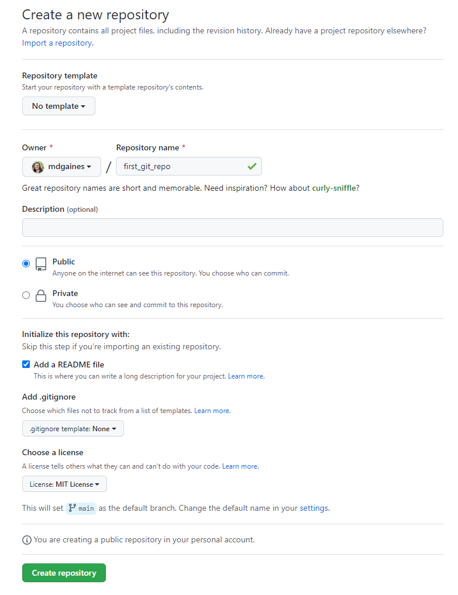
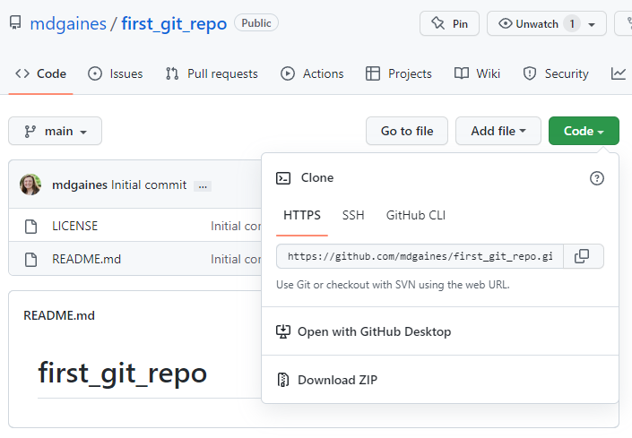
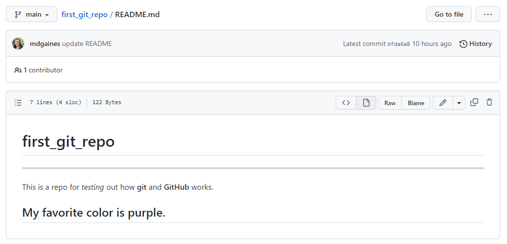

## Intro to GitHub

Version Control Systems (VCS) allow you to track software revisions over time and help a team manage changes over time.

One of the most popular VCS is [git](https://git-scm.com/). Git records the history of changes as a stream of snapshots. 
Git is a distributed VCS (every team member's copy of the code will contain the
full history of changes) rather than having one single place for recording the 
history of changes. 

Git is not the same as [GitHub](https://github.com/), Git is a VCS for managing your
code history, GitHub is a hosting service (owned by Microsoft) for your Git repos. 
There are other hosting services besides GitHub, 
Butbucket is another popular one. 

You can sign up for a free account and host public and private **repositories (repos)**, essentially folders that hold all of your code. GitHub was designed to be public, so avoid uploading any confidential or private information. Additionally, GitHub encourages *open-source code*, where creators allow others to freely access, distribute, and modify it. There are different open-sources lisences you can choose from when you create a new **repo**.

Follow this link [GitHub](https://www.github.com) and sign-up or login if
you've already gotten an account.

In the right hand corner pick the "New Repository" under the "+" sign. Give your repo a name (`first_git_repo`) and make it **public**. Check the `Add a README file` box. Choose a license - here, let's go with the MIT License. It's a very permissive open-source license. Lastly, hit `Create repository`.



This creates a *remote repository*, meaning that it exists entirely online, independent of the files on your personal computer.

After creating the remote repository we have 2 options:

1: download/clone the repo and start making changes  
2: initialize a local repo and connect it with the remote one

1) The clone command is used to download a remote repo (cloning should be done at the very start of the project!):

```
git clone https://www.github.com/user/project_name.git  
```

2) If you have already initialized a local repo you can
connect it to the remote one using the following command:

``` 
git remote add origin:https://www.github.com/user/project_name.git
```

We can get the link to our remote repo for cloning by clicking the green `Code` button and copying the HTTPS link.



### Clone a git repo

First you need to have git installed from [here](https://git-scm.com/downloads).

Next, navigate to the folder for this class from the command prompt or in VS Code.

In the terminal or command prompt, list the files in your directory (folder).

```
   (Mac)               (Windows)
>>> ls -a           >>> dir
```

You should get a list of all the files and folders in your directory.

Next, **clone** the repo we just made in GitHub via the command line:
'''>>> git clone https://www.github.com/[USERNAME]/first_git_repo.git'''

Now list the files in you directory again. Did anything change?

### Modifying a git repo

Navigate to the new directory that was just created.
```cd first_git_repo```

List the files in this directory. Is that what you expected?

Open this directory in VS Code and open the README.md file.

Add a few lines to your readme. Example:
```

---

This is a repo for *testing* out how **git** and **GitHub** works.

## My favorite color is purple.
```

Save the edits in your README. We can track the status of our local files compared with our remote branch in the terminal:
```git status```

What is the message you see?

Before we update our remote repo, let's add a `.gitignore` file. This file allows us to ignore local files we do not want to go to our repote repo. 

After creating the .gitignore, open it in VS Code and add `desktop.ini`. This is a Windows-specific background file that can cause issues. If you are using a Mac, it will be nice to have this in the .gitignore for when you are working with collaborators.

Now, run `git status` again. What changed in the message you got?

### git add

Next, we will look at updating our remote repo.

Check your GitHub repo. Do you see the changes we made in VS Code?

To get these changes to GitHub, we need to take seveal steps.

From [An Intro to Git and GitHub for Beginners (Tutorial)](https://product.hubspot.com/blog/git-and-github-tutorial-for-beginners):

"One of the most confusing parts when you're first learning git is the concept of the staging environment and how it relates to a commit.

A commit is a record of what changes you have made since the last time you made a commit. Essentially, you make changes to your repo (for example, adding a file or modifying one) and then tell git to put those changes into a commit.

Commits make up the essence of your project and allow you to jump to the state of a project at any other commit.

So, how do you tell git which files to put into a commit? This is where the staging environment or index come in. As seen in Step 2, when you make changes to your repo, git notices that a file has changed but won't do anything with it (like adding it in a commit).

To add a file to a commit, you first need to add it to the staging environment. To do this, you can use the git add <filename> command (see Step 3 below).

Once you've used the git add command to add all the files you want to the staging environment, you can then tell git to package them into a commit using the git commit command. 

Note: The staging environment, also called 'staging', is the new preferred term for this, but you can also see it referred to as the 'index'."


To add our updated README and our .gitignore to our remote repo, we will first **add** them to the staging area using `git add`. We can add specific files by naming them (e.g., `git add README.md`) or we can add them all using `git add .`

Run one of these and see what happens. Now check the status again.


### git commit

To create a commit, we can use the `git commit` command. We can (and should!) add a message to each of our commits. The message helps us and our collaborators keep track of what has been changed between two different versions of the file in the repo. Clear explanations will be extremely helpful to your future self and others.

Create your commit with a message. Exmaple:
```
git commit -m "updated README, added .gitignore"
```
Now, check your status again. What does your GitHub repo look like?

### git push

The commit records the changes, like a snapshot or a "save game" in a videogame. The **push** is where we send these snapshots (our commits) from our local repo to our remote repo. (Yes, you can have multiple commits before pushing!)

Run: `git push`

Now, check your status again. What does your GitHub repo look like? Can you see your commit message?


### Look at File Changes

Go to your repo on GitHub and click on the word `commits` at the top right, across from your username and your last commit message.

Click on the top (most recent) commit. What do you see? What is this showing you?

Go back to the repo by clicking the repo name at the top of the screen.


### Editing in GitHub

We can also make edits to our files on GitHub.

Go to your repo on GitHub and click on the `README.md` file. Next, click on the pencil in the upper right side of the file.



Change something in one of the lines that already exists. Add another line of text.

Lastly, type in a commit message (e.g., "update readme from GH") and click `Commit changes`.

The changes appear! Check your local file. Are the changes there? Try `git status`. What does it say?

Click the word `History` in the top right corner (where `commits` was on the repo page). Again, click on the most recent commit. What is this telling you? How does it differ from our previous commit?


### git pull

Our local file is now behind our remote repo, but never fear! We can get the most recent version using `git pull`. Try this command in your terminal. What happened? Do you see changes to your local file?

### Congrats! You've made it through the core of git!

Now, on to the maps!